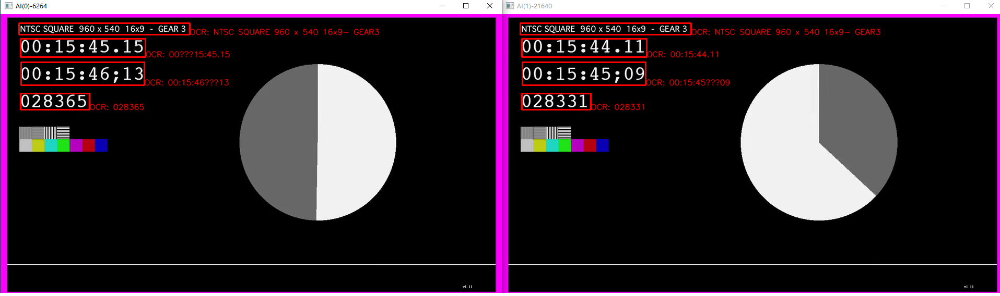

**V2V测试联调指南**
=====================
V2V是Video to Vector的意思。就是希望把视频这种非结构化的数据变为Vector这种容易处理的数据，然后发给iot。

本项目支持从主流NVR，IPC监控设备获取rtsp流解码，调度分布式AI服务器，达到实时识别，实时转发iot的效果。通过国标GB28181协议，本项目能通过PTZ指令控制现场摄像头多巡航点轮番识别、跟踪识别。


一、快速体验
--------
### 预装环境
- Windows10系统，NVIDIA显卡（RTX2060或更好）。
- 已经下载v2v-ai和v2v的源码并解压到本地硬盘E:\_proj\v2v-ai和E:\_proj\v2v。
- 已经安装Miniconda3虚拟环境，v2v-ai依赖的GPU开发环境（参考《V2V-AI开发环境搭建方案》）。
- 已经安装virtualenv python3环境及v2v需要的包（v2v依赖的环境）。

### 运行步骤
Windows10环境下代码演示如下。
1.打开EasyDarwin服务器。
2.在  E:\_proj\odoo-14.0.post20201231\venv\Scripts  目录打开一个终端窗口。
3.在命令行输入如下命令。
```
E:\_proj\odoo-14.0.post20201231\venv\Scripts>activate
(venv) E:\_proj\odoo-14.0.post20201231\venv\Scripts>cd ..\..\..\v2v\scripts
(venv) E:\_proj\v2v\scripts>push_main.bat
(venv) E:\_proj\v2v\scripts>mock
(venv) E:\_proj\v2v\scripts>v2v
```
4.在开始菜单点击Anaconda3（64-bit），Anaconda Promote（Miniconda3），进入conda v38gpu环境，运行如下命令。
```
(v38gpu) E:\_proj\v2v-ai\ai-server>uvicorn run:app --port 7180 --host 192.168.101.19 --ssl-keyfile=../keys/cert.key --ssl-certfile=../keys/cert.cer
```

对一段标准视频流实时识别的结果。


二、源码开发指南
--------
源码调测v2v需要搭建如下环境。
在开发机（develop windows）上安装好pycharm社区版。
后续所有命令都需要运行在python 3.6.8及以上的虚拟环境下。
通过pip安装虚拟环境（virtualenv）不赘述，主要过程是先要yum或apt-get安装python3.x的版本。
用安装好的python3.x版本的对应pip3.x来安装一个virtualenv包，再用python运行virtualenv包创建虚拟环境。
最后在虚拟环境的bin目录，source activate，激活虚拟环境。之后在这个虚拟环境下pip安装各种包即可。


1.下载代码到本地，安装requirments.txt的包。

```
(v2v) bda@c3daace9a16d:~/work$ git clone https://gitee.com/iovVis/v2v.git v2v
(v2v) bda@c3daace9a16d:~/work$ cd v2v
(v2v) bda@c3daace9a16d:~/work$ pip install -r requirments.txt
(v2v) bda@c3daace9a16d:~/work$ export PYTHONPATH=$PYTHONPATH:/home/bda/work/v2v/src/
(v2v) bda@c3daace9a16d:~/work$ cd tests
```
如果是windows的命令行环境，则通过如下方式设置环境变量PYTHONPATH。
```
(venv) E:\_proj\odoo-14.0.post20201231\v2v\tests>set PYTHONPATH=%PYTHONPATH%;..\src
```
如果是windows的powershell环境，则通过如下方式设置环境变量PYTHONPATH。
```
(venv) E:\_proj\odoo-14.0.post20201231\v2v\tests>$Env:PYTHONPATH += ";..\src"
```
2.在命令行终端界面上，进行流媒体功能测试。

2.1 启动easydarwin服务器，在终端用ffmpeg推流，ffplay测试播放。
easyDarwin服务器在vs目录下的EasyDarwin-windows-8.1.0-1901141151下的EasyDarwin.exe，双击执行。
ffmpeg推流工具和ffplay播放工具在vs目录下的ffmpeg-win64-gpl-vulkan下的bin目录，命令行运行如下。
```
$ ffmpeg -re -stream_loop -1 -i ./plc.mp4 -rtsp_transport tcp -vcodec libx264 -f rtsp rtsp://127.0.0.1:7554/plc
$ ffmpeg -re -stream_loop -1 -i ./panel.mp4 -rtsp_transport tcp -vcodec libx264 -f rtsp rtsp://127.0.0.1:7554/panel
$ ffmpeg -re -stream_loop -1 -i ./person.mp4 -rtsp_transport tcp -vcodec libx264 -f rtsp rtsp://127.0.0.1:7554/person

$ ffplay -rtsp_transport tcp rtsp://192.168.101.19:7554/plc
```
  【注意】easyDarwin为服务器时在easydarwin.ini中设置一下rtsp的端口为7554，要避免与已有端口冲突。

2.2 启动仿真接口。
```
(v2v) bda@c3daace9a16d:~/work/tests$ cd ../src/mock
(v2v) bda@c3daace9a16d:~/work/v2v/src/mock$ python exif.py
```
  【注意】启动仿真接口前要确定，设置对应的流媒体路径与上面的推流地址匹配，在exif.py文件stream_info函数内，大致166等行位置json的url键对应的值。

2.3 在代码的tests路径下启动v2v服务。
```
(v2v) bda@c3daace9a16d:~/work/tests$ python test_main.py
```

3.缺省通过浏览器访问所有的rest接口。
主程序的REST接口
https://127.0.0.1:7080/docs
仿真程序的REST接口
https://127.0.0.1:7180/docs

4.缺省的配置界面。
https://127.0.0.1:7080/ui/v2vlabel/editors/gallery.html

三、v2v运行的配置文件
--------
v2v程序的正常运行依赖如下一些配置文件。
1.tests目录下的v2v.cfg文件——主配置文件，确定要识别的流媒体源及预置点配置、mqtt服务器地址等、本地启动的微服务端口、视频调度服务器地址等。
这些信息在程序运行后，会由CDM下发配置进行更新。
2.tests目录下的baseconfig.cfg文件——配置jaeger服务器地址/端口等监控需要的信息。
3.tests目录下的logging.conf文件——配置日志文件记录方式。
4.src/mock目录下的cert.cer，cert.key文件——https服务依赖的证书和密钥文件。

四、v2v运行的监控
--------
1.v2v支持prometheus和jaeger指标监测，需要提前安装Prometheus和Jaeger，命令如下。
```
docker run \
    -p 9090:9090 \
    -v /path/to/prometheus.yml:/etc/prometheus/prometheus.yml \
    prom/prometheus

docker run -d --name jaeger \
  -e COLLECTOR_ZIPKIN_HOST_PORT=:9411 \
  -p 5775:5775/udp \
  -p 6831:6831/udp \
  -p 6832:6832/udp \
  -p 5778:5778 \
  -p 16686:16686 \
  -p 14250:14250 \
  -p 14268:14268 \
  -p 14269:14269 \
  -p 9411:9411 \
  jaegertracing/all-in-one:1.29
```
  【注意】：promethues安装挂出到宿主机的配置文件prometheus.yml参考如下。
```
# my global config
global:
  scrape_interval:     15s # Set the scrape interval to every 15 seconds. Default is every 1 minute.
  evaluation_interval: 15s # Evaluate rules every 15 seconds. The default is every 1 minute.
  # scrape_timeout is set to the global default (10s).

# Alertmanager configuration
alerting:
  alertmanagers:
  - static_configs:
    - targets:
      # - alertmanager:9093

# Load rules once and periodically evaluate them according to the global 'evaluation_interval'.
rule_files:
  # - "first_rules.yml"
  # - "second_rules.yml"

# A scrape configuration containing exactly one endpoint to scrape:
# Here it's Prometheus itself.
scrape_configs:
  # The job name is added as a label `job=<job_name>` to any timeseries scraped from this config.
  - job_name: 'prometheus'

    # metrics_path defaults to '/metrics'
    # scheme defaults to 'http'.

    static_configs:
    - targets: ['localhost:9090']
   
  - job_name: 'v2v'
    scrape_interval: 1s
    metrics_path: /metrics
    scheme: https
    tls_config:
        insecure_skip_verify: true
    static_configs:
    - targets: ['192.168.101.19:7080']
    params:
        v2v: ['rest','rtsp']
```

2.Prometheus的配置。
需要配置Prometheus的prometheus.yml文件（docker通过volume映射在外部，targets的地方ip地址要配置为v2v的运行地址和端口）。
```
scrape_configs:
  # The job name is added as a label `job=<job_name>` to any timeseries scraped from this config.
  - job_name: 'v2v'
    scrape_interval: 1s
    metrics_path: /metrics
    scheme: https
    tls_config:
        insecure_skip_verify: true
    static_configs:
    - targets: ['192.168.101.19:7080']
    params:
        v2v: ['rest','rtsp']

```
3.Jaeger配置。
需要配置v2v的tests目录的baseconfig.cfg配置文件，jaeger配置项的agent_ip和agent_port要配置正确。
```
{
  "version": "1.0.0",
  "jaeger": {
    "agent_ip": "192.168.47.144",
    "agent_port": 6831,
    "node_name": "GD",
    "enable": true
  }
}
```
4.启动v2v主进程，如果一切正常，将从Prometheus查询到cpu_rate，mem_rate，up_time三个v2v指标。
prometheus的主界面访问接口如下示例。
http://192.168.47.144:9090

5.启动v2v的管道操作，如果一切正常，将会在jaeger主控制台看到v2v的mqtt进程上报的数据。

5.1 访问v2v的7080的api调试端口如下示例。
https://192.168.101.19:7080/docs
执行post /api/v1/v2v/pipeline调用，Request body的命令为{"cmd":"start"}。
该接口调用将启动v2v的视频解码、ai识别、mqtt数据上报任务流水线，如果传入{"cmd":"stop"}将停止流水线操作。

5.2 jaeger的主界面访问接口如下示例。
http://192.168.47.144:16686
在Service下拉列表中，过几秒时间就可以看到v2v_GD这样的服务。
选择下拉列表的MQTT(0)-xxxxx，点击Find Trace绿色按钮，右侧图形就会显示MQTT发起的链路调用。

五、离线部署与安装
--------
```
$ pip freeze > requirements.txt 
$ pip download -d . -r requirements.txt

$ pip install --no-index --find-links=pack -r requirements.txt
```

六、特性
--------

- 支持标注。
- 支持取流并存为背景进行标注。
- 支持mqtt上报，并提供jaeger通信追踪上报。
- 支持config配置动态载入。
- 支持主进程管理所有子进程流水线，想要停哪个进程就停哪个。
- 识别结果以图片发布为图片浏览器。
- 日志记录方式可以通过配置文件设定。

七、待办事项
--------
- 支持pipeline在程序启动后自动启动。
- 配置数据在客户端重新显示（更换浏览器后）。
- UI美化。 
- 远程调用的输入参数和返回值没有规范化，应该统一为类便于修改。
- 当配置文件出错的时候，程序行为的定义。
- ctrl+c关闭程序的时候，windows和linux有不同的反应，代码还没屏蔽此差异（rest.py）。

致谢
=====================

Cookiecutter。
simple-photo-gallery。


lvyu

26896225@qq.com

