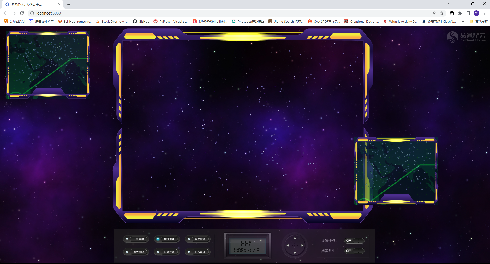

# MAPF前端工程


## 概览

参考了Infinite Runner in Phaser 3 with TypeScript工程，Phaser3官方的Scene相关工程，前端实现一个多窗口动画交互框架。

## 快速开始


```bash
npm install -g parcel-bundler
npm install
npm run start
```

浏览器访问 http://localhost:8083/



## 致谢

[界面素材](https://www.freepik.com/search?format=search&page=2&query=hud+interface&selection=1) freepik网站

[House Background art](https://www.gameartguppy.com/shop/house-1-repeatable-background/) from Game Art Guppy

[Rocket Mouse art](https://www.gameartguppy.com/shop/rocket-mouse-game-art-character/) from Game Art Guppy

[参考代码1](https://github.com/ourcade/infinite-runner-template-phaser3) 《Infinite Runner in Phaser 3 with TypeScript》

[参考代码2](https://github.com/photonstorm/phaser3-examples/tree/master/public/src/scenes/tutorial) 官方场景控制

[参考代码3](https://github.com/photonstorm/phaser3-examples/tree/master/public/src/scenes/multi%20demo) 官方多窗口项目


## 许可协议

[MIT License](https://github.com/ourcade/infinite-runner-template-phaser3/blob/master/LICENSE)
